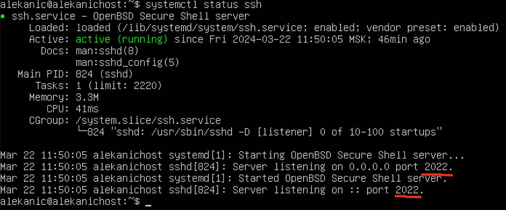
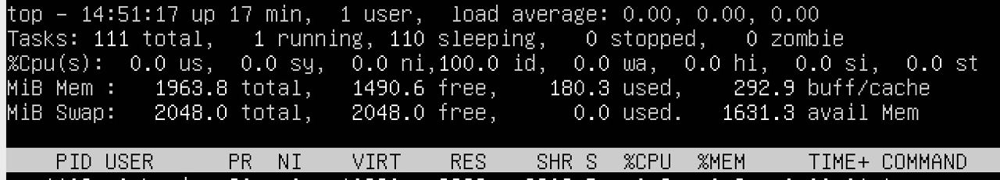
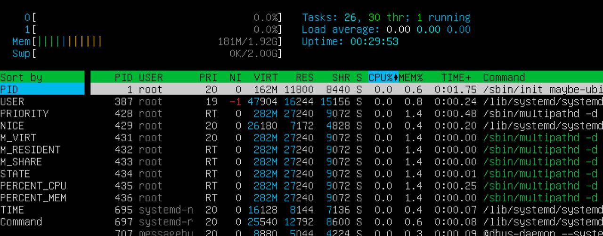
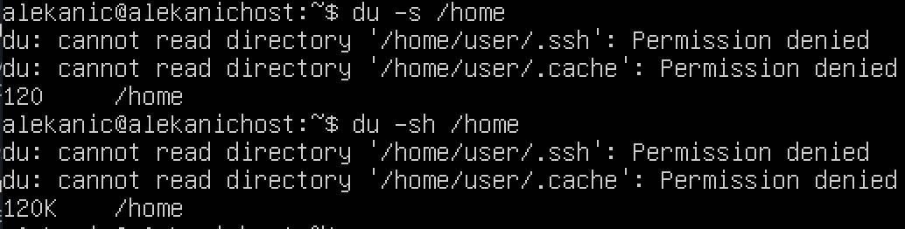

## Оглавление
*Не работает на GitLab (к глубочайшему сожалению автора), но корректно работает на Github и в Visual Studio Code* :unicorn:

+ [Part 1. Установка ОС](#title1) 
+ [Part 2. Создание пользователя](#title2)
+ [Part 3. Настройка сети ОС](#title3)
+ [Part 4. Обновление ОС](#title4)
+ [Part 5. Использование команды SUDO](#title5)
+ [Part 6. Установка и настройка службы времени](#title6)
+ [Part 7. Установка и использование текстовых редакторов](#title7)
+ [Part 8. Установка и базовая настройка сервиса SSHD](#title8)
+ [Part 9. Установка и использование top, htop](#title9)
+ [Part 10. Использование утилиты fdisk](#title10)
+ [Part 11. Использование утилиты df](#title11)
+ [Part 12. Использование утилиты du](#title12)
+ [Part 13. Установка и использование утилиты ncdu](#title13)
+ [Part 14. Работа с системными журналами](#title14)
+ [Part 15. Использование планировщика заданий CRON](#title15)

## <a id="title1">Part 1. Установка ОС</a>

1. **Установить Ubuntu 20.04 Server LTS без графического интерфейса (с использованием программы для виртуализации - VirtualBox). Графический интерфейс должен отсутствовать.**

> Ubuntu — это бесплатный дистрибутив, разработанная на базе Linux ядра. Дистрибутив - это как подарочный набор, в который может входить сама ОС, какой-то набор программ и драйверов, плюс графическая оболочка. Мб даже игры.

Чтобы узнать версию Ubuntu, необходимо выполнить команду: `cat /etc/issue`. 

\
*Версия Ubuntu*

## <a id="title2">Part 2. Создание пользователя</a>

1. **Создать пользователя, отличного от созданного при установке.**

Команда для создания пользователя: 

```$ sudo adduser username```

2. **Пользователь должен быть добавлен в группу adm. Новый пользователь должен быть в выводе команды: `cat /etc/passwd`.**

Команда для добавления пользователя в группу `adm`:

```$ sudo usermod -aG adm username```

\
*Добавление пользователя в группу*

## <a id="title3">Part 3. Настройка сети ОС</a>

1. **Задать название машины вида `user-1`.**

>Имя хоста - это некая метка, идентифицирующая устройство в сети. В одной сети не может быть несколько машин с одинаковым именем хоста.

Чтобы посмотреть текущее имя машины, можно воспользоваться командой:

`$ sudo hostnamectl`

Изменение имени хоста может быть временным (сохранится только до перезагрузки), или постоянным. Чтобы сделать изменения постоянными, нужно изменить содержимое двух файлов:

+ `/etc/hostname`
+ `/etc/hosts`

А именно: в этих файлах нужно заменить текущее название машины на желаемое.

Также в современных версиях ubuntu можно использовать команду `hostnamectl`, он в отличие от первого варианта изменения вступят в силу только после перезагрузки машины:

`$ sudo hostnamectl set-hostname new_name`

.jpg "Изначальное название машины user")\
*Изначальное название машины `user`*

.jpg "Измененное название машины user-1")\
*Измененное название машины `user-1`*

>`static` - традиционное имя хоста, которое хранится в файле `/etc/hostname`\
\
`transient` - динамическое имя хоста, поддерживаемое ядром. Серверы DHCP или mDNS могут изменить временное имя хоста во время выполнения. По умолчанию оно совпадает со static-именем.

2. **Установить временную зону, соответствующую текущему местоположению.**

Чтобы проверить текущую временную зону, нужно выполнить команду:

`timedatectl`

.jpg "Текущая временная зона")\
*Текущая временная зона*

Для установки временной зоны, необходимо заранее знать наименование подходящей временной зоны (в нашем случае это `Moscow-Europe`). Узнать название желаемой временной зоны можно, вызвав список всех временных зон, желательно отфильтровав по городу:

`timedatectl list-timezones | grep Moscow`

.jpg "Список временных зон")\
*Список временных зон*

Для смены временной зоны можно воспользоваться командой:

`$ sudo timedatectl set-timezone Europe/Moscow`

.jpg "Измененная временная зона")\
*Измененная временная зона*

3. **Вывести названия сетевых интерфейсов с помощью консольной команды. В отчёте дать объяснение наличию интерфейса lo.**

>`Сетевые интерфейсы` - это часть аппаратного устройства, которое позволяет операционкам и программам передавать данные через компьютерную сеть.\
\
Для обычного пользователя сетевой интерфейс выглядит как физическая сетевая плата (`network interface controller, NIC`), однако есть и виртуальные адаптеры.\
\
`Виртуальный сетевой интерфейс` - технологическая система, с помощью которой можно передавать данные между приложениями. А еще они используются для организации VPN-туннелей или в облачной инфраструктуре для подключения виртуальных устройств.

Чтобы вывести на экран перечень используемых сетевых интерфейсов, можно воспользоваться командой:

`ifconfig`

.jpg "Сетевые интерфейсы")\
*Сетевые интерфейсы*

В данный момент в системе только один интерфейс - это `enp0s3`, есть еще `lo`, но он виртуальный и указывает на эту машину.

>`enp0s3` - это интерфейс, связанный с сетевой картой. Если бы сетевых карт было несколько, то кроме eth0s3, был бы еще eth1 и так далее.\
\
`lo (loopback device)` - виртуальный интерфейс, присутствующий по умолчанию в любом Linux. Используется для отладки сетевых программ и запуска серверных приложений на локальной машине.

Есть и другие команды, которые позволят вывести информацию о сетевых интерфейсах:

+ `ls /sys/class/net` - можно просто вывести содержимое необходимого каталога
+ `ip link show` - вывести перечень сетевых интерфейсов с основными настройками
+ `ip -br link show` - вывести перечень сетевых интерфейсов с основными настройками в таличном виде

4. **Используя консольную команду, получить ip адрес устройства, на котором ты работаешь, от DHCP сервера. В отчёте расшифровать DHCP.**

>`DHCP (dynamic host conficuration protocol)` - протокол динамической настройки узла. DHCP-сервер позволяет устройству автоматически получать локальный ip-адрес.\
\
Каждый роутер оснащен DHCP-сервером, поэтому при подключении к Wi-fi, устройство автоматически получают IP-адрес.\
\
IP-адреса, полученные с DHCP-сервера считаются динамическими, потому что при каждом новом подключении или перезагрузки роутера, DHCP-сервер тоже перезагружается и может выдать устройствам разные ip-адреса.

Для настройки получения адреса от DHCP-сервера, удобно использовать утилиту `Netplan`. Ubuntu 17.10 и новее использует Netplan в качестве инструмента управления сетью по умолчанию.

>Предыдущие версии Ubuntu использовали ifconfig и его файл конфигурации /etc/network/interfaces для настройки сети.

Файлы конфигурации Netplan записываются в синтаксисе YAML. Чтобы настроить сетевой интерфейс с помощью Netplan, необходимо создать описание YAML для интерфейса, после чего Netplan сгенерирует необходимые файлы конфигурации для выбранного инструмента рендеринга.

Конфигурационный файл находится по адресу:

`ls /etc/netplan`

\
*Конфигурационный файл*

После редактирования можно применить конфигурацию:

`sudo netplan try`

Далее можно проверить, присвоился ли ip адрес:

`ip address`

\
*Проверка присвоения ip адреса*

Можно отдельной командой получить ip адрес от DHCP-сервера:

`$ sudo dhclient -v`

\
*Получение ip-адреса от DHCP*

5. **Определить и вывести на экран внешний ip-адрес шлюза (ip) и внутренний IP-адрес шлюза, он же ip-адрес по умолчанию (gw).**

>`Шлюз` - это один из типом маршрутизаторов (доставщиков пакетов). Соединяют несколько сетей и передают пакеты между ними на сетевом уровне.

Для просмотра адресов шлюзов можно выполнить команду:

`ip route`

\
*Проверка адресов шлюзов*

6. **Задать статичные (заданные вручную, а не полученные от DHCP сервера) настройки ip, gw, dns (используй публичный DNS серверы, например 1.1.1.1 или 8.8.8.8).**

Снова надо залезть в файл конфигурации и изменить его:

`$ sudo nano /etc/netplan/00-installer-config.yaml`

\
*Изменения в конфигурационном файле*

*Если Вам, как и автору в начале пути, абсолютно непонятно **ОТКУДА БРАТЬ адрес и шлюз**, то вот хороший вариант - можно взять те данные, которые предоставил DHCP в выводе команды `ip route`:*

\
*Откуда взять данные адреса и маршрутизатора*

Снова применяем конфигурацию:

`$ sudo netplan try`

Проверить результаты можно командами `ip address` и `ip route`:

\
*Проверка статических настроек*


7. **Перезагрузить виртуальную машину. Убедиться, что статичные сетевые настройки (ip, gw, dns) соответствуют заданным в предыдущем пункте.**

Для перезагрузки сервера можно использовать команду:

`reboot`

И еще раз проверяем настройки с помощью команды `ip address` и `ip route`:

\
*Проверка статических настроек после перезагрузки*

8. **Успешно пропингуй удаленные хосты 1.1.1.1 и ya.ru и вставь в отчёт скрин с выводом команды. В выводе команды должна быть фраза «0% packet loss».**

\
*Успешный пинг*

## <a id="title4">Part 4. Обновление ОС</a>

1. **Обновить системные пакеты до последней на момент выполнения задания версии.**

Можно обновить системные пакеты следующей командой:

`$ sudo apt update`

Далее полностью обновляется весь дистрибутив с разрешением удаления конфликтующих пакетов:

`$ sudo apt dist-upgrade`

2. **После обновления системных пакетов, если ввести команду обновления повторно, должно появиться сообщение, что обновления отсутствуют. Прикрепить скриншот.**

\
*Обновление пакетов*

Проверка наличия обновления системы происходит с помощью команды:

`$ sudo do-release-upgrade -c`

И если обновление доступно, система предложит выполнить следующую команду:

`$ sudo do-release-upgrade`

После обновления при повторном введении команды появляется сообщение, что обновления системы отсутствуют:

\
*Обновление системы*

## <a id="title5">Part 5. Использование команды SUDO</a>

1. **Разреши пользователю, созданному в Part 2,выполнять команду sudo. В отчёте объясни истинное назначение команды sudo.**

Чтобы разрешить пользователю выполнять команду sudo, нужно добавить его в группу `sudo`. Добавление пользователя (alekanic) в группу происходит с помощью следующей команды:

`$ sudo usermod -G sudo alekanic`

Проверить успешное добавление пользователя в группу можно вызвав информацию о пользователе:

\
*Информация о пользователе*

>`sudo` (substitute user and do) - это утилита, которая дословно переводится как "подменить пользователя и выполнить". Это основной способ повышать привелегии в современных Linux-системах. Все, что лежит вне домашней директории пользователя и требует дополнительных прав, скорее должно запускаться с sudo, но бывают и исключения.\
\
>*Очень историческая справка\
Исторически единственным универсальным способом выполнить команду от имени другого пользователя в Unix была программа `su`. Запущенная без параметров, она подменяла текущее имя пользователя на root, оставляя почти все переменные окружения от старого пользователя.\
\
При этом доверенным пользователям приходилось помнить пароль root и у всех пользователей, перечисленных в группе wheel (т.е. в группе, члены которой могли выполнить команду su и стать суперпользователем), был одинаковый неограниченный доступ ко всей системе, что являлось серьезной проблемой безопасности.\
\
Затем появилась команда sudo, и это был прорыв. Теперь администратор мог указывать список разрешенных команд для каждого пользователя (или группы пользователей), файлы, доступные для редактирования, специальные переменные для окружения и многое другое (все это великоление управляется из /etc/sudoers). При запуске sudo спрашивает у пользователя его собственный пароль, а не пароль root.*

2. **Поменяй hostname ОС от имени пользователя, созданного в пункте Part 2 (используя sudo). Вставь скрин с изменённым hostname в отчёт.**

Чтобы посмотреть текущее имя машины, можно воспользоваться командой:

`$ sudo hostnamectl`

От имени созданного пользователя нужно отредактировать те же 2 файла и сохранить:

+ `/etc/hostname`
+ `/etc/hosts`

\
*Первоначальное имя хоста еще не отображается после `alekanic@`*

После перезагрузки системы измененное имя хоста будет отображаться после имени пользователя:

.jpg "Измененное имя хоста")\
*Измененное имя хоста отображается после `alekanic@*

## <a id="title6">Part 6. Установка и настройка службы времени</a>

1. **Настрой службу автоматической синхронизации времени. Выведи время часового пояса, в котором ты сейчас находишься.**

Чтобы вывести текущее время часового пояса, можно воспользоваться командой:

`timedatectl show`

.jpg "До синхронизации времени")\
*До синхронизации времени*

Для синхронизации времени удобно воспользоваться утилитой `ntpdate`. Для начала ее нужно установить:

`$ sudo apt install ntpdate`

В качестве параметра ntpdate принимает адрес сервера точного времени, с которого будет произведена синхронизация локальных часов. Можно воспользоваться пулом серверов точного времени - `pool.ntp.org`

`$ sudo ntpdate pool.ntp.org`

Пул автоматически выбирает сервер точного времени, с которым синхронизируются часы. С помощью локальной службы ntp можно автоматизировать процесс синхронизации времени.

Можно установить ntp, работающую в режиме клиента, с помощью команды:

`$ sudo apt install ntp`

Далее необходимо запустить ntp:

`$ sudo systemctl enable --now ntp`

Можно проверить статус синхронизации с помощью команды:

`$ sudo systemctl status ntp`

\
*Статус синхронизации времени*

Дополнительно с помощью команды запускаем ntp:

`timedatectl set-ntp true`

2. **Вывод команды `timedatectl show` должен содержать `NTPSynchronized=yes:`. Вставить скрины с корректным временем и выводом команды в отчёт.**

.jpg "После синхронизации времени")\
*После синхронизации времени*

## <a id="title7">Part 7. Установка и использование текстовых редакторов</a>

1. **Установить текстовые редакторы VIM (+ любые два по желанию NANO, MCEDIT, JOE и т.д.). Используя каждый из трех выбранных редакторов, создать файл `test_X.txt`, где X -- название редактора, в котором создан файл. Напиши в нём свой никнейм, закрой файл с сохранением изменений. Сделай скриншот из каждого редактора с содержимым файла перед закрытием. В отчёте укажи, что сделал для выхода с сохранением изменений.**
 
 ### VIM 

+ Открытие файла с помощью редактора VIM происходит с помощью команды:\
`$ sudo vim test_vim.txt`
+ По умолчанию VIM открывается в командном режиме. Чтобы перейти в режим редактирования, необходимо нажать клавишу `i`, после чего можно будет внести нужные изменения.
+ Для сохранения изменений и выхода из файла, необходимо снова перейти в командный режим с помощью клавиши `Esc`, и комбинации `:wq`.

\
*VIM - созданный файл с моим ником*

  ### NANO

+ Открытие файла с помощью редактора NANO происходит с помощью команды:\
`$ sudo nano test_nano.txt`
+ Для сохранения изменений и выхода из файла, необходимо ввести комбинацию `^X`, после чего редактор предложит сохранить изменения перед выходом, и нужно будет ввести `Y` ("Yes"), и нажать `Enter` для подтверждения имени файла, в который будут внесены изменения.

\
*NANO - созданный файл с моим ником*

   ### JOE

+ Открытие файла с помощью редактора JOE происходит с помощью команды:\
`$ sudo joe test_nano.txt`
+ Для сохранения изменений необходимо ввести комбинацию `Ctrl + K + D`, для выхода из файла - комбинацию `Ctrl + K + X`.

\
*JOE - созданный файл с моим ником*

2. **Используя каждый из трех выбранных редакторов, открыть файл на редактирование, отредактировать файл, заменив никнейм на строку `21 School 21`, закрыть файл без сохранения изменений. Сделать скриншот в каждом редакторе с содержимым файла после редактирования. В отчете указать, что необходимо сделать для выхода без сохранения изменений**. 

### VIM

+ Для выхода без сохранения изменений необходимо снова перейти в командный режим с помощью клавиши `Esc`, и ввести комбинацию `:qa!`. 

\
*VIM - Изменный несохраненный файл*

### NANO

+ Для выхода без сохранения изменений необходимо ввести комбинацию `^X`, после чего редактор предложит сохранить изменения, и нужно будет ввести `N` ("No").

\
*NANO - Изменный несохраненный файл*

### JOE

+ Для выхода без сохранения изменений необходимо ввести комбинацию `Ctrl + C`.

\
*JOE - Изменный несохраненный файл*

3. **Используя каждый из трех выбранных редакторов, отредактировать файл ещё раз (по аналогии с предыдущим пунктом), а затем освоить функции поиска по содержимому файла (слово) и замены слова на любое другое. Сделать скриншоты из каждого редактора с результатами поиска слова, с командами, введенными для замены слова на другое.**

### VIM

+ Для поиска по содержимому файла и замены слова необходима следующая комбинация:\
`:s/words/special words/g`, где `words` - это слово **которое** нужно заменить, а `special words` - это выражение **на которое** нужно заменить.

\
*VIM - результат поиска*

.jpg "VIM - результат замены")\
*VIM - результат замены*

### NANO

+ Для поиска по содержимому файла и замены слова необходима комбинация: `^\`, после чего нужно будет ввести слово для поиска, нажать `Enter` для подтверждения. Далее нужно будет ввести слово для замены и снова нажать `Enter` для подтверждения. Можно будет изменить одно совпадение (`Y`) или все (`A`), или отказаться от замены (`N`).

\
*NANO - результат поиска*

.jpg "NANO - результат замены")\
*NANO - результат замены*

### JOE

+ Для поиска по содержимому файла необходима комбинация: `Ctrl + K + F`. Далее нужно будет ввести слово для поиска, и подтвердить его, нажав `Enter`. Для замены нужно выбрать в опциях `R`, ввести замену и снова подтвердить с помощью `Enter`.

\
*JOE - результат поиска*

.jpg "JOE - результат замены")\
*JOE - результат замены*

## <a id="title8">Part 8. Установка и базовая настройка сервиса SSHD</a>

>`SSH (Secure Shell)`- это сетевой протокол, который обеспечивают безопасное поключение клиента к серверу. Любое взаимодействие подвергается шифрованию, предотвращая хищение передаваемых по сети данных и других удаленных сетевых атак.\
\
SSHd - это служба, принимающая запросы на соединения от клиентов, т.е. от других компьютеров.

1. **Установить службу SSHd. Добавить автостарт службы при загрузке системы.**

>Настройка сервера SSH производится путем настройки программа-демона SSHd. Программа-демон - это программа, запускаемая самой системой и работающая в фоновом режиме.

OpenSSH не предустанавливается в системе, поэтому служба устанавливается вручную следующей командой:

`$ sudo apt install openssh-server`

Запуск службы:

`$ sudo systemctl enable --now ssh`

Ключ `--now` в команде выше отвечает за одновременный запуск программы и добавление ее в автозагрузку.

Проверка, что служба включена и успешно функционирует:

`systemctl status ssh`

\
*Статус службы ssh после установки*

Перед подключением к серверу через протокол SSH надо проверить состояние брандмауэра. Хотя во время установки службы и происходит настройка файрвола, повторная проверка поможет убедиться, что он настроен правильно.
Для проверки можно воспользоваться интерфейсом `UFW (Uncoplicated Firewall)`.

Дополнительный шаг - сделать ufw активным:

`$ sudo ufw enable`

Вызов проверки:

`$ sudo ufw status`

\
*Статус ufw*

2. **Перенастроить службу SSHd на порт 2022.**

>Если оставить порт стандартным, т.е. 22, то велика вероятность, что он будет слишком часто сканироваться роботами.

Основные настройки OpenSSH-серверы хранятся в главном конфигурационном файле - `sshd_config`, с расположением /etc/ssh.

Перед тем, как приступать к редактированию, необходимо создать резервную копию данного файла **(на всякий случай)**:

`$ sudo cp /etc/ssh/sshd_config /etc/ssh/sshd_config.initial`

Далее необходимо отредактировать файл:

\
*Измененный конфигурационный файл*

Чтобы изменения вступили в силу, необходимо перезагрузить слубжу:

`$ sudo systemctl restart ssh`

Проверить, что порт успешно изменен, можно с помощью команды:

`systemctl status ssh`

\
*Статус службы ssh после изменения порта*

4. **Используя команду ps, показать наличие процесса sshd. Для этого к команде нужно подобрать ключи. В отчете объяснить значение команды ps и каждого ключа в ней.**

>`ps` - это утилита для просмотра списка процессов в Linux. Интерактивный режим не поддерживает, зато имеет множество опций (НЕ КЛЮЧЕЙ) для настройки вывода тех или иных параметров процессов.\
\
Для поиска определенного процесса удобно использоать такой вариант:\
`$ ps опции | grep параметр`.

Можно воспользоваться командой:

`ps -A | grep ssh`

Опция `-А` в данном случае означает, что нужно выбрать все процессы.

\
*Поиск процесса sshd через ps*

5. **Перезагрузить систему. И проверить, что sshd слушает порт с помощью команды netstat. Объяснить значение ключей -tan, значение каждого столбца вывода, значение 0.0.0.0.**

>`netstat (network statistics)` - утилита, выводящая на дисплей состояние TCP-соединений, таблицы маршрутизации, число сетевых интерфейсов и сетевую статистику по протоколам.\
Основное назначение утилиты - поиск сетевых проблем и определение производительности сети.

Можно сначала проверить версию установленного netstat:

`netstat --version`

\
*Версия netstat*

По заданию, вывод команды `netstat -tan` должен содержать следующее:\

`tcp 0 0 0.0.0.0:2022 0.0.0.0:* LISTEN`

\
*Вывод команды netstat tan*

>Утилита `netstat` поддерживает параметры, которые отображают активные или пассивные сокеты с помощью параметров -t, -n или -a. Флаги показывают разъемы подключения RAW, UPD или UNIX. Добавив опцию -a, утилита будет создавать сокеты, готовые к соединению.\
\
Также эта команда показывает информацию о состоянии соединения (например, ESTABLISHED, LISTENING, TIME_WAIT и др.)\
\
*`-tan` - это все отдельные параметры, поэтому можно вводить их как -ant, или как душе угодно.*\
\
`0.0.0.0` означает, что IP-адрес, связанный с активным сетевым соединением, является адресом всех IP-адресов. Это обычно означает, что служба или приложение, связанное с этим соединением, слушает все IP-адреса на данном компьютере.

## <a id="title9">Part 9. Установка и использование top, htop</a>

>Команда `top` показвыает запущенные в Linux процессы программ и служб, данные о потреблении системных ресурсов и позволяет искать, останавливать процессы и управлять ими.\
\
Команда `htop` выполняет примерно ту же задачу, что и top, но имеет определенные преимущества и недостатки: более удобные поиск и фильтрация, но менее гибкая настройка отображения процесса.

1. **Установи и запусти утилиты top и htop.**

Установка top выполняется с помощью команды:

`$ sudo apt install top`

Установка htop выполняется с помощью команды:

`$ sudo apt install htop`

Запуск команды `top`:

`$ top`

\
*Вывод команды top*

Запуск команды `htop`:

`$ htop`

\
*Вывод команды htop*

2. **По выводу команды top определи и напиши в отчёте:**

\
*Вывод команды top*

+ **uptime** - 17 min
+ **количество авторизованных пользователей** - 1 user
+ **общую загрузку системы** - (load average) 0.00 0.00 0.00
+ **общее количество процессов** - (total) 111
+ **загрузку cpu** - (%Cpu(s)):

0.0 us, 0.0 sy, 0.0 ni, 100.0 id, 0.0 wa, 0.0 hi, 0.0 si, 0.0 st

+ **загрузку памяти** - (MiB MEM/MIB Swap):

MiB MEM: 1963.8 total, 1490.6 free, 180.3 used, 292.9 buff/cache
MIB Swap: 2048.0 total, 2048.0 free, 0.0 used, 1631.3 avail Mem

\
*Вывод команды top*

+ **pid процесса занимающего больше всего памяти** - 1
+ **pid процесса, занимающего больше всего процессорного времени** - 1102

3. **В отчёт вставить скриншоты с выводом команды htop:**

В отчете htop есть встроенная навигация:

\
*Панель нафигации в htop*

+ **отсортированному по PID, PERCENT_CPU, PERCENT_MEM, TIME**

Для перехода в режим сортировки нужно нажать `F6`, и далее выбрать параметр для сортировки:

\
*Меню параметров для сортировки*

\
*Cортировка по PID*

\
*Cортировка по PERCENT_CPU*

\
*Cортировка по TIME*

+ **отфильтрованному для процесса sshd**

Для перехода в режим сортировки нужно нажать `F4`, и далее начать вводить процесс, по которому нужно отфильтровать:

\
*Фильтрация по sshd*

+ **с процессом syslog, найденным, используя поиск**

Для перехода в режим сортировки нужно нажать `F3`, и далее начать ввести название процесса, которое нужно найти:

\
*Поиск syslog*

+ **с добавленным выводом hostname, clock и uptime**

Для изменения отображаемых на верхней панели данных, нужно залезть в настройки с помощью `F2`, и найти необходимые для задания параметры:

\
*Дополнительные параметры в htop*

## <a id="title10">Part 10. Использование утилиты fdisk</a>

>`fdisk` - это утилита для разметки диска, создания на нем разделов и просмотра уже существующих.\
\
Общий синтаксис: `fdisk опции устройство` 

1. **Запустить команду fdisk -l. В отчёте описать название жесткого диска, его размер и количество секторов, а также размер swap.**

>Опция `-l` позволяет посмотреть список доступных дисков и разделов.

`$ sudo fsidk -l`

\
*Вывод команды fdisk*

+ Название жесткого диска:

Disk /dev/mapper/ubuntu--vg-ubuntu--lv

+ Размер жесткого диска: 11.5 GiB
+ Количество секторов: 24109056 sectors
+ Размер swap: 

Для определения размера swap можно воспользоваться следующими командами:\

+ `swapon --show` - команда, предназначенная для обработки подкачки памяти. Помимо предоставления точной информации об используемом пространстве подкачки, также сообщает, является ли пространство подкачки разделом или файлом подкачки.
+ `free -h` - проверить использование памяти в Linux с удобочитаемым выводом (`-h`)

\
*Размер swap*

В данном случае пространство подкачки является файлом, поэтому не отображается при выводе команды `fdisk -l`.

## <a id="title11">Part 11. Использование утилиты df</a>

>`df (disk free)` - утилита, позволяющая проверить использование дискового пространства в ОС. Отображает информацию об общем, свободном и используемом объеме памяти файловых систем.

1. **Запустить команду df. В отчёте описать для корневого раздела (/):**

\
*Вывод команды df*

+ **размер раздела** - 11758760
+ **размер занятого пространства** - 5810388
+ **размер свободного пространства** - 5329264
+ **процент использования** - 53%
+ **единица измерения** - 1 Кб

3. **Запустить команду df -Th. В отчёте описать для корневого раздела (/):**

\
*Вывод команды df -Th*

+ **размер раздела** - 12 G
+ **размер занятого пространства** - 5.6 G
+ **размер свободного пространства** - 5.1 G
+ **процент использования** - 53%
+ **тип файловой системы для раздела** - ext4

## <a id="title12">Part 12. Использование утилиты du</a>

1. **Запустить команду du.**

\
*Вывод команды du*

2. **Вывести размер папок /home, /var, /var/log (в байтах, в человекочитаемом виде)**

Для того, чтобы с помощью команды `du` вывести размер папок в байтах, необходимо добавить опцию `-s`, а чтобы вывести размер в человекочитаемом виде, еще опцию `-h`:

+ **/home**

\
*Вывод размера /home с помощью du*

+ **/var**

\
*Вывод размера /var с помощью du*

+ **/var/log**

\
*Вывод размера /var/log с помощью du*

3. **Вывести размер всего содержимого в /var/log (не общее, а каждого вложенного элемента, используя \*)**

\
*Вывод размера всего содержимого в /var/log с помощью du*

## <a id="title13">Part 13. Установка и использование утилиты ncdu</a>

>`Ncurse Disk Usage (ncdu)` - анализатор диска, который предоставляет информацию о распределении и использовании дискового пространства на компьютере или сервере.\
\
Ncdu работает в текстовом режиме с использованием библиотеки `curses`, что позволяет вывести информацию в удобочитаемом формате в терминале. Он сканирует указанный каталог и предоставляет детальную информацию о размере каталогов и файлов.`

1. **Установить утилиту ncdu**

Утилита устанавливается командой:

`$ sudo apt-get install ncdu`

\
*Вывод команд ncdu*

2. **Вывести размер папок `/home`, `/var`, `/var/log`. Размеры должны примерно совпадать с полученными в Part 12.**

Чтобы вывести размер папки `/dirname` с помощью команды `ncdu`, нужно использовать команду: `ncdu /dirname`.

\
*Вывод размера /home с помощью команды ncdu*

\
*Вывод размера /var с помощью команды ncdu*

\
*Вывод размера /var/log с помощью команды ncdu*

## <a id="title14">Part 14. Работа с системными журналами</a>

1. **Открыть для просмотра:**

Открыть логи для просмотра можно с помощью утилиты `cat`, с помощью `less` - для просмотра логов с функцией прокрутки, или `tail` - для просмотра логов в реальном времени.

+ `/var/log/dmesg`

\
*Вывод /var/log/dmesg*

+ `/var/log/syslog`

\
*Вывод /var/log/syslog*

+ `/var/log/auth.log`

\
*Вывод /var/log/auth.log*

2. **Написать в отчёте время последней успешной авторизации, имя пользователя и метод входа в систему.**

+ **Время последней успешной авторизации** - 17:59:08
+ **Имя пользователя** - alekanichost
+ **Метод входа в систему** - sudo

3. **Перезапустить службу SSHd. Вставить в отчёте скрин с сообщением о рестарте службы (искать в логах).**

Перезапуск sshd осуществляется с помощью команды:

`$ sudo service ssh restart`

Чтобы найти сообщения о перезапуске ssh системы, достаточно открыть `/var/log/auth.log` с помощью `tail`.

\
*Поиск в логах информации о перезапуске службы sshd*

## <a id="title15">Part 15. Использование планировщика заданий CRON</a>

>Cron - это хронологический демон-планировщик задач, работающий в ОС типа Unix, включая дистрибутивы Linux. Запускается в фоновом режиме, а задачи, запланированные в нем, выполняются автоматически, что делает cron полезным для автоматизации связанных с обслуживанием задач.

1. **Используя планировщик заданий, запустить команду uptime через каждые 2 минуты.**

Скачать Сron можно с помощью команды:

`$ sudo apt install cron`

Далее следует убедиться, что он настроен для работы в фоновом режиме:

`$ sudo systemctl enable cron`

>Задачи в cron записываются и управляются в специальном файле `crontab`. Каждый профиль пользователя в системе может иметь собственный файл crontab, где составляются расписания задач, которые хранятся в `/var/spool/cron/crontabs/`.

Открытие файла crontab происходит с помощью команды:

`crontab -e`

Задачи, запланированные в crontab, выглядят следующим образом:

\
*Формат задач в crontab*

Для выполнения команды uptime каждые 2 минуты, достаточно изменить файл crontab следующим образом:

\
*Постановка задачи в crontab*

Символ `*` служит подстановочным символом, который представляет все значения.
Комбинация символов `*/` обозначает значение шага. Например, для запуска команды каждые 2 минуты. 

2. **Найти в системных журналах строчки (минимум две в заданном временном диапазоне) о выполнении**

\
*Запись в логах о выполнении команды uptime*

3. **Вывестии на экран список текущих заданий для CRON**

Вывести на экран список задач (ака просто вывести на экран все содержимое) можно с помощью команды:

`crontab -l`

\
*Просмотр задач в cron*

4. **Удалить все задания из планировщика заданий. В отчёт вставить скрин со списком текущих заданий для CRON**

Удалить все задачи из сron можно с помощью команды:

`crontab -r`

\
*Удаление всех задач из cron*


